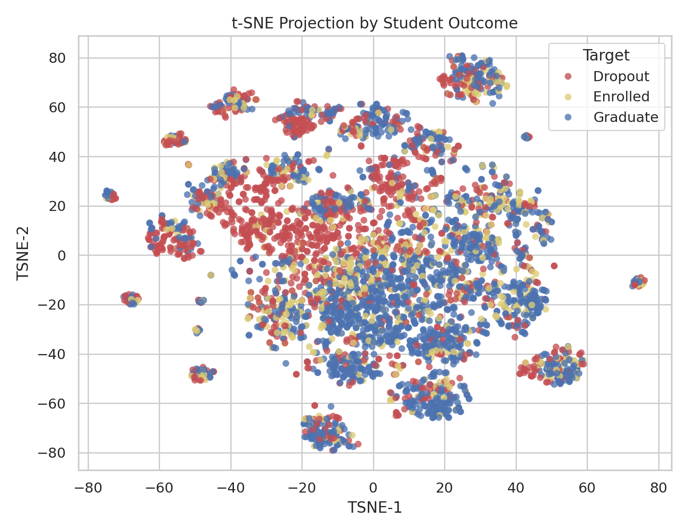
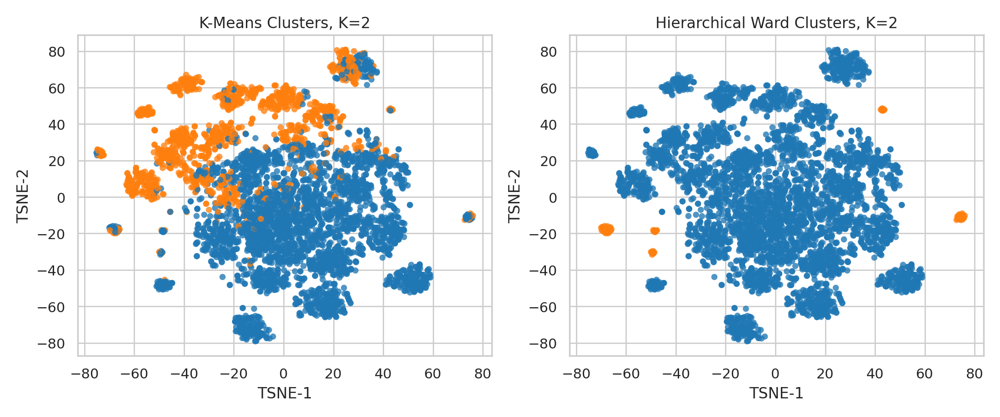
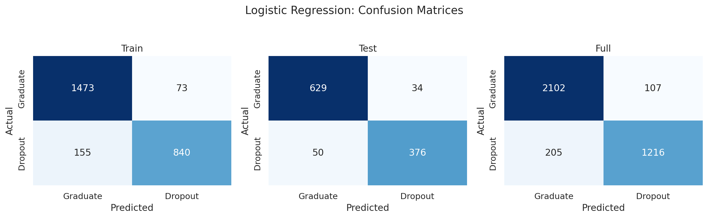
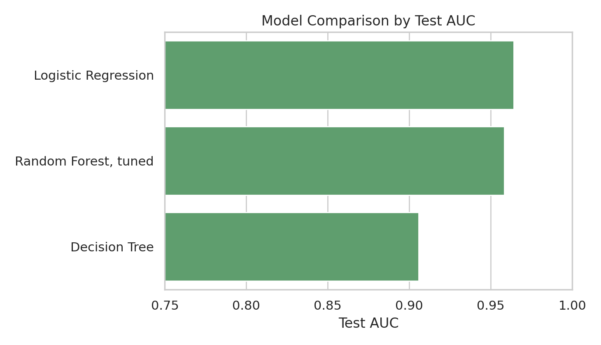
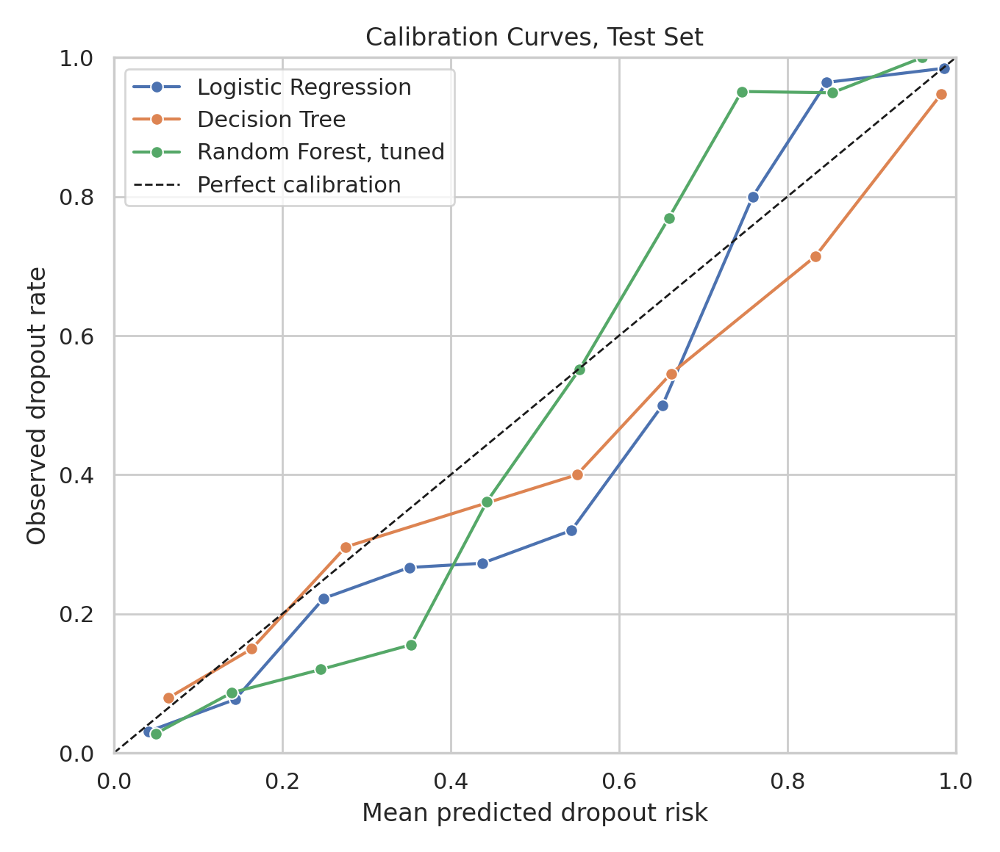

# Introduction

本项目基于 UCI **Predict Students' Dropout and Academic Success** 数据集完成学生辍学分析。数据包含 4424 名本科学生、36 个原始特征，目标变量为 Dropout、Enrolled 与 Graduate，其中 Dropout=1421、Enrolled=794、Graduate=2209。分析路线为：先进行缺失值、类别变量和标准化处理，再用 t-SNE 与聚类观察高维结构，最后将任务转为 Dropout vs Graduate 二分类，比较逻辑回归、决策树和随机森林，并补充校准、干预覆盖、公平性与错误案例分析。

# 1. Data Preprocessing

缺失值检查显示最大缺失率为 0.00%，没有列超过 40% 阈值，因此未删除特征。数值型变量使用中位数填充，类别型变量使用众数填充；18 个类别变量经独热编码处理，其中 Application mode, Course, Father's occupation, Father's qualification, Mother's occupation, Mother's qualification, Nacionality, Previous qualification 等高基数变量只保留 Top 5 类别，其余归为 Other。标准化前特征矩阵为 [4424, 36]，处理后为 [4424, 96]。该流程兼顾异常值鲁棒性、类别变量可建模性和不同量纲特征的可比性。

# 2. Data Visualization and Clustering

{ width=4.8in }

t-SNE 使用 perplexity=30、learning_rate=200、random_state=42。二维嵌入显示三类样本存在局部聚集，但整体交叠明显：Dropout 在若干区域密度较高，Graduate 在中心和右下区域较集中，Enrolled 常落在两者之间。这说明学生状态与早期学业、经济和人口统计变量相关，但并不存在简单线性边界。Enrolled 标签代表尚未结束的学业过程，其混合分布也支持后续二分类中剔除该类的决定。

K-Means 与 Ward 层次聚类均在 K=2 至 8 中搜索，K-Means 用肘部法则和轮廓系数选择 K，层次聚类结合树状图和轮廓系数。结果如下：

| algorithm | k | silhouette | calinski_harabasz | ARI_vs_Target |
| --- | --- | --- | --- | --- |
| K-Means | 2 | 0.111 | 233.633 | 0.072 |
| Agglomerative Ward | 2 | 0.411 | 193.517 | 0.001 |

层次聚类的 silhouette=0.411，内部距离分离较强；但其 ARI 仅 0.001，几乎不能复现真实学业结局。K-Means 的 CH 指数和 ARI 更高，虽 silhouette 较低，但与 Target 的对应关系更强。因此若目标是辅助理解学生结果结构，K-Means 更有实用价值；若只看内部距离分离，Ward 层次聚类更占优。

{ width=4.8in }

# 3. Prediction: Training and Testing

监督学习将 Target 转为二分类：Dropout 为正类，Graduate 为负类。Enrolled 样本被剔除，因为该类学生最终结果尚不明确，作为监督标签会降低模型置信度。二分类数据包含 Graduate=2209、Dropout=1421，采用 70%/30% 分层抽样。逻辑回归作为稳定线性基线，决策树设置 max_depth=5 以限制过拟合。测试集混淆矩阵显示逻辑回归漏判 Dropout 50 人，决策树漏判 84 人，逻辑回归更适合辍学预警。

| Logistic Regression | Decision Tree |
| --- | --- |
| { width=3.0in } | { width=3.0in } |

# 4. Evaluation and Model Choice

测试集指标如下：

| model | accuracy | precision | recall | f1 | AUC |
| --- | --- | --- | --- | --- | --- |
| Logistic Regression | 0.923 | 0.917 | 0.883 | 0.900 | 0.964 |
| Decision Tree | 0.894 | 0.917 | 0.803 | 0.856 | 0.906 |

{ width=4.8in }

逻辑回归在 Accuracy=0.923、Recall=0.883、F1=0.900、AUC=0.964 上均优于或明显优于决策树。5 折交叉验证中，逻辑回归 AUC=0.951±0.006，决策树 AUC=0.914±0.004。逻辑回归训练准确率 0.910、测试准确率 0.923，泛化稳定；决策树训练准确率 0.913、测试准确率 0.894，差距不大但 Recall 偏低。综合排序能力、漏报控制和交叉验证稳定性，逻辑回归是本任务中最合适的简单模型。

# 5. Open-ended Exploration

## 5.1 Feature Importance, Model Comparison, and Imbalance

随机森林 impurity importance 的 Top 5 如下，主要集中在两个学期的通过课程数、成绩与学费状态，具有明确教育解释：学业完成度低和财务压力会同时提高辍学风险。

| original_feature | importance |
| --- | --- |
| Curricular units 2nd sem (approved) | 0.168 |
| Curricular units 1st sem (approved) | 0.123 |
| Curricular units 2nd sem (grade) | 0.106 |
| Curricular units 1st sem (grade) | 0.070 |
| Tuition fees up to date | 0.065 |

随机森林使用 GridSearchCV 调整 n_estimators、max_depth 与 min_samples_leaf，最佳参数为 `{'rf__max_depth': None, 'rf__min_samples_leaf': 1, 'rf__n_estimators': 300}`。三类模型测试集表现如下：

| model | accuracy | recall | f1 | AUC |
| --- | --- | --- | --- | --- |
| Logistic Regression | 0.923 | 0.883 | 0.900 | 0.964 |
| Random Forest, tuned | 0.921 | 0.857 | 0.895 | 0.958 |
| Decision Tree | 0.894 | 0.803 | 0.856 | 0.906 |

调参随机森林 AUC=0.958，优于决策树但略低于逻辑回归，说明复杂模型未必带来更高泛化收益。类别不平衡方面，Dropout/Graduate 比例为 0.643；SMOTE 将逻辑回归 Recall 从 0.883 提升到 0.904，但 AUC 略降，因此更适合“少漏报”优先的策略，而非默认替代原始模型。

{ width=4.5in }

## 5.2 Early Warning and Intervention Value

{ width=4.6in }

早期预警实验严格控制信息可用时间点。只使用入学时已知信息时，AUC=0.838、Recall=0.634；加入第一学期表现后，AUC 提升到 0.939、Recall 提升到 0.852；再加入第二学期后，AUC=0.964、Recall=0.883。因此，完整模型更像回顾性诊断，而 `Enrollment + 1st semester` 模型更适合可行动预警。

| experiment | AUC | recall | precision |
| --- | --- | --- | --- |
| Enrollment only | 0.838 | 0.634 | 0.738 |
| Enrollment + 1st semester | 0.939 | 0.852 | 0.892 |
| Enrollment + 1st + 2nd semester | 0.964 | 0.883 | 0.917 |

{ width=4.6in }

干预覆盖曲线比 ROC 更接近教育管理场景。使用第一学期可行动模型时，跟进风险最高的 25% 学生可覆盖 62.68% 的真实 Dropout，名单中的 Dropout 比例为 97.80%；完整模型对应覆盖率为 63.85%。两者差距不大，说明第一学期模型已经足以支持有限资源下的优先排序。若设定 top-25% 容量策略，完整逻辑回归在测试集中标记 272 人，Precision=0.996、Recall=0.636。

## 5.3 From Correlation to Trustworthy Explanation

{ width=4.6in }

为了判断风险分是否可解释为概率，本项目绘制校准曲线并计算 Brier score。结果如下：

| model | brier_score | expected_calibration_error | mean_predicted_risk |
| --- | --- | --- | --- |
| Logistic Regression | 0.058 | 0.031 | 0.415 |
| Decision Tree | 0.089 | 0.025 | 0.400 |
| Random Forest, tuned | 0.068 | 0.062 | 0.403 |

逻辑回归的 Brier score=0.058，低于决策树和调参随机森林，说明其概率输出更适合解释为辍学风险。进一步使用 `CalibratedClassifierCV` 后，最佳 Brier score 来自 Logistic Regression, isotonic，为 0.057。PDP 显示，当 `Curricular units 2nd sem (approved)` 从 0 增至 6 时，随机森林平均预测风险由 0.652 降至 0.310；`Tuition fees up to date` 从 0 变为 1 时，风险由 0.648 降至 0.387。反事实风格模拟中，“学费按时缴纳 + 第二学期通过课程数增加 3”使平均风险下降 0.166。这些结果适合生成干预假设，但仍不是因果估计。

## 5.4 Uncertainty, Fairness, and Error Cases

模型总体指标使用 1000 次 bootstrap 估计 95% 置信区间：

| model | AUC_95CI | Recall_95CI |
| --- | --- | --- |
| Logistic Regression | 0.964 [0.951, 0.976] | 0.883 [0.853, 0.912] |

逻辑回归 AUC 的 95% CI 为 0.964 [0.951, 0.976]，Recall 的 95% CI 为 0.883 [0.853, 0.912]，总体较稳健。公平性分析按 Gender、International 与 Scholarship holder 分组计算 Recall、FPR、Brier score 和 group-wise calibration；International=1 组仅 27 人，Recall=0.846，Wilson 95% CI 为 [0.578, 0.957]，bootstrap Recall 95% CI 为 [0.615, 1.000]，因此不应过度解读小样本群体的点估计。错误案例方面，逻辑回归漏判 50 名 Dropout；漏判者在 `Curricular units 2nd sem (approved)` 上均值为 5.720，高于正确识别 Dropout 的 1.213，说明部分辍学学生在结构化学业和财务变量上看似安全，仍需人工复核和非结构化信息补充。

# Conclusion

无监督分析表明三类学业结果有局部结构但重叠明显，不能仅靠自然聚类替代监督预测。监督学习中，逻辑回归以 AUC=0.964 和 Recall=0.883 成为最佳简单模型；调参随机森林作为开放探索模型接近逻辑回归但未超过它。更深入的开放探索显示，第一学期信息已能将 AUC 从 0.838 提升到 0.939，是早期预警的关键时间点；第二学期通过课程数、学费状态和第一学期通过课程数是最核心因素。干预覆盖曲线、校准后模型、bootstrap 公平性区间、时间泄漏讨论和错误案例画像进一步说明，模型可以支持风险排序和干预假设，但部署时必须同时报告概率校准、群体差异、不确定性和模型失败模式。

# References

1. UCI Machine Learning Repository. Predict Students' Dropout and Academic Success. https://archive.ics.uci.edu/dataset/697/predict+students+dropout+and+academic+success
2. Pedregosa et al. Scikit-learn: Machine Learning in Python. Journal of Machine Learning Research, 2011.
3. van der Maaten and Hinton. Visualizing Data using t-SNE. Journal of Machine Learning Research, 2008.
