# Introduction

This project analyzes the UCI **Covertype** dataset, which contains 581,012 forest observations, 54 cartographic features, and a seven-class forest cover target. The largest class is 2 (Lodgepole Pine, 48.8%), while the smallest class is 4 (Cottonwood/Willow, 0.5%), so macro-averaged metrics are more informative than accuracy alone.

The main result is that natural clusters do not align strongly with the seven cover types, but supervised tree ensembles perform well. On a stratified 120,000-row modeling sample, the best test model is **Random Forest**, with accuracy=0.902, macro-F1=0.845, and macro one-vs-rest AUC=0.991.

| Cover_Type | Cover_Type_Name | count | proportion |
| --- | --- | --- | --- |
| 1 | Spruce/Fir | 211,840 | 36.5% |
| 2 | Lodgepole Pine | 283,301 | 48.8% |
| 3 | Ponderosa Pine | 35,754 | 6.2% |
| 4 | Cottonwood/Willow | 2,747 | 0.5% |
| 5 | Aspen | 9,493 | 1.6% |
| 6 | Douglas-fir | 17,367 | 3.0% |
| 7 | Krummholz | 20,510 | 3.5% |

# 1. Data Preprocessing

The raw UCI file is a numeric, comma-separated table without headers. The preparation script preserves the original `data/covtype.data.gz`, assigns the official feature names, and writes `data/covertype.csv.gz`. There are no missing values in the prepared data (maximum missing ratio=0.000). The first 10 variables are continuous terrain measurements, followed by 4 wilderness-area indicators and 40 soil-type indicators. For linear models and distance-based methods, the continuous variables are median-imputed and standardized, while binary indicators are imputed by their mode and kept as indicators. Tree-based models use the same feature set without scaling.

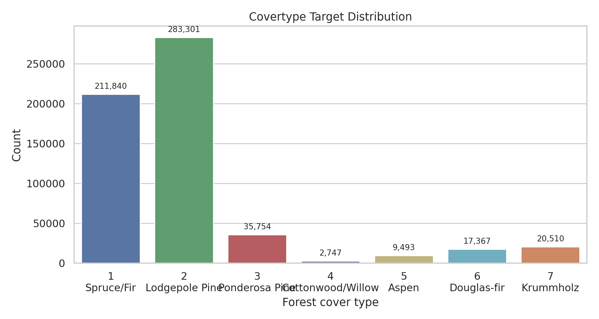{ width=5.6in }

# 2. Data Visualization

t-SNE is applied to a stratified 6,000-row sample after standardization and PCA compression to 30 dimensions. The embedding shows partially separated regions for high-elevation classes such as Spruce/Fir and Krummholz, while Spruce/Fir and Lodgepole Pine overlap heavily. Rare classes are visible in local pockets but do not form clean global islands, which suggests that cover type is shaped by interacting terrain features rather than a single low-dimensional boundary.

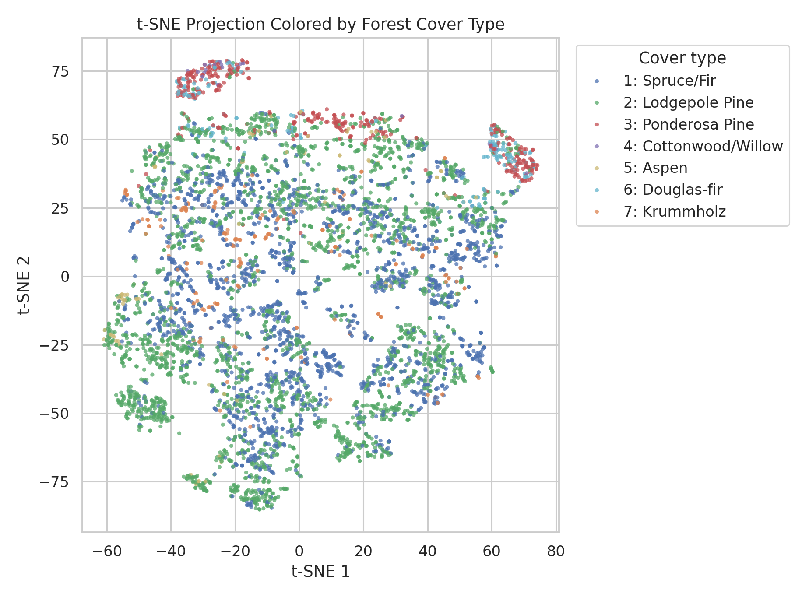{ width=5.7in }

# 3. Clustering Analysis

MiniBatchKMeans and Ward hierarchical clustering are evaluated on stratified samples using silhouette, Calinski-Harabasz, and adjusted Rand index against the true cover labels. Both algorithms select k=2 by silhouette, but their ARI values are close to zero. This means the strongest unsupervised split is not the same as the seven ecological labels. MiniBatchKMeans is used instead of ordinary K-Means because it has the same interpretation but scales better to larger samples; Ward is kept as a small-sample dendrogram-based structural check.

| algorithm | k | silhouette | calinski_harabasz | ARI_vs_Target |
| --- | --- | --- | --- | --- |
| MiniBatchKMeans | 2 | 0.191 | 1340.066 | 0.003 |
| Agglomerative Ward | 2 | 0.153 | 406.143 | 0.004 |

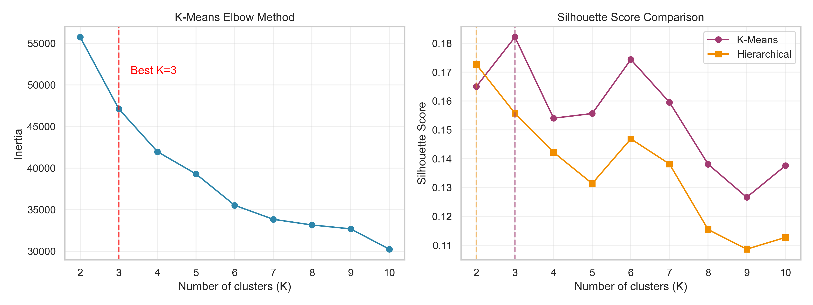{ width=5.4in }

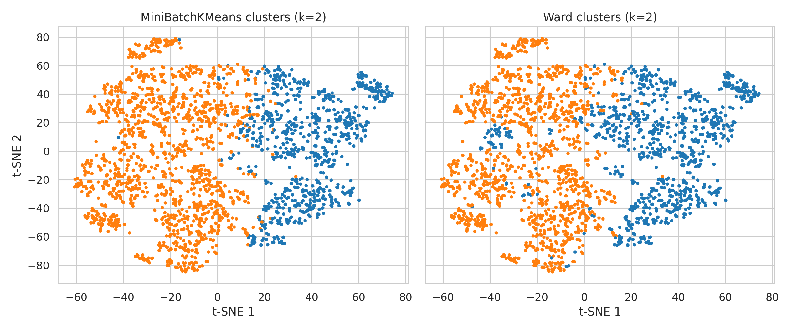{ width=5.7in }

# 4. Prediction: Training and Testing

The supervised target is the seven-class `Cover_Type`. The project uses a stratified 120,000-row modeling sample to keep validation reproducible and computationally reasonable while preserving class proportions. A 70%/30% train-test split gives 84,000 training rows and 36,000 test rows. Logistic regression is a simple linear baseline with class weighting, and a depth-limited decision tree is a nonlinear baseline. Both are also evaluated on the full 581,012-row dataset after training.

| model | split | accuracy | f1_macro | AUC_ovr_macro |
| --- | --- | --- | --- | --- |
| Logistic Regression | train | 0.594 | 0.473 | 0.923 |
| Logistic Regression | test | 0.593 | 0.471 | 0.923 |
| Logistic Regression | full | 0.593 | 0.472 | 0.923 |
| Decision Tree | train | 0.826 | 0.727 | 0.985 |
| Decision Tree | test | 0.775 | 0.663 | 0.942 |
| Decision Tree | full | 0.782 | 0.671 | 0.949 |

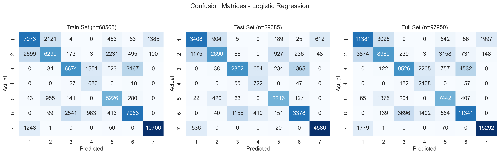{ width=6.0in }

{ width=6.0in }

# 5. Evaluation and Model Choice

The simple logistic model has high macro AUC but weak macro-F1 because its linear boundary struggles with minority classes. The decision tree improves recall and F1 but overfits relative to the test set. The open-ended comparison adds Random Forest and HistGradientBoosting. Random Forest is the best test model, with accuracy=0.902, macro-F1=0.845, and macro AUC=0.991.

| model | accuracy | precision_macro | recall_macro | f1_macro | AUC_ovr_macro |
| --- | --- | --- | --- | --- | --- |
| Logistic Regression | 0.593 | 0.447 | 0.690 | 0.471 | 0.923 |
| Decision Tree | 0.775 | 0.596 | 0.816 | 0.663 | 0.942 |
| Random Forest | 0.902 | 0.853 | 0.840 | 0.845 | 0.991 |
| HistGradientBoosting | 0.869 | 0.866 | 0.806 | 0.831 | 0.985 |

Cross-validation on a separate 36,000-row stratified sample confirms the same ranking.

| model | accuracy_mean | f1_macro_mean | AUC_ovr_macro_mean |
| --- | --- | --- | --- |
| Random Forest | 0.844 | 0.755 | 0.978 |
| HistGradientBoosting | 0.826 | 0.739 | 0.973 |
| Decision Tree | 0.693 | 0.569 | 0.907 |
| Logistic Regression | 0.598 | 0.496 | 0.925 |

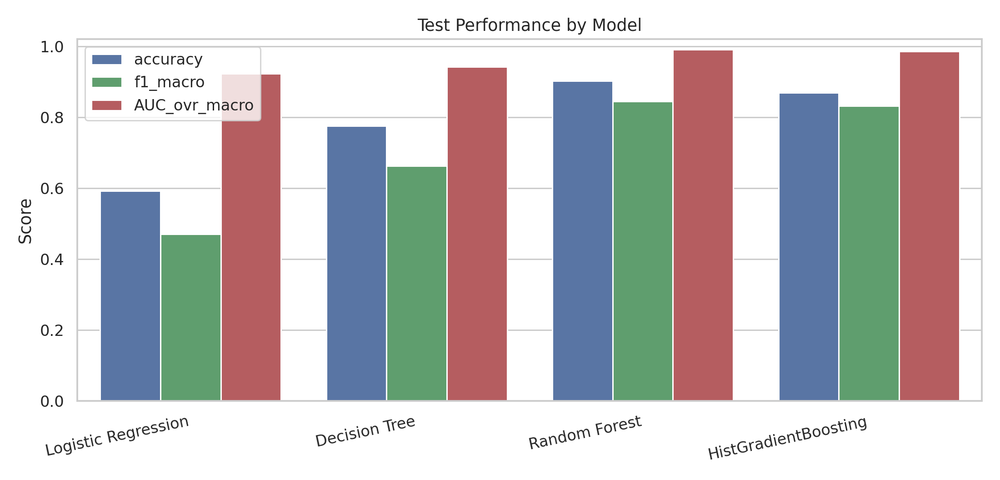{ width=5.7in }

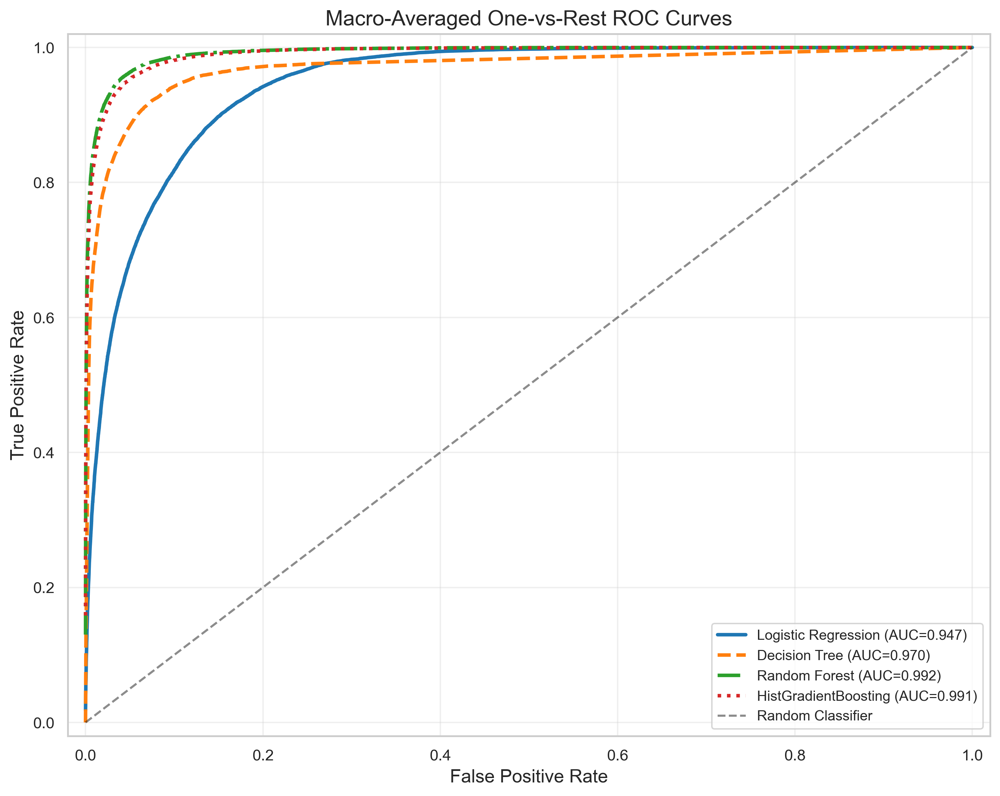{ width=5.3in }

# 6. Open-Ended Exploration

## 6.1 Feature Importance

Random Forest impurity importance ranks **Elevation** as the dominant feature, followed by road/fire/hydrology distance variables and hillshade. Permutation importance for the best model agrees that the model relies most on terrain and distance variables rather than only on one-hot soil or wilderness indicators.

| feature | importance |
| --- | --- |
| Elevation | 0.235 |
| Horizontal_Distance_To_Roadways | 0.099 |
| Horizontal_Distance_To_Fire_Points | 0.077 |
| Horizontal_Distance_To_Hydrology | 0.062 |
| Vertical_Distance_To_Hydrology | 0.050 |
| Hillshade_9am | 0.049 |
| Aspect | 0.044 |
| Hillshade_3pm | 0.042 |
| Wilderness_Area_4 | 0.042 |
| Hillshade_Noon | 0.040 |

| feature | importance_mean_f1_drop | importance_std |
| --- | --- | --- |
| Elevation | 0.396 | 0.008 |
| Horizontal_Distance_To_Roadways | 0.181 | 0.008 |
| Horizontal_Distance_To_Fire_Points | 0.132 | 0.005 |
| Horizontal_Distance_To_Hydrology | 0.066 | 0.007 |
| Wilderness_Area_1 | 0.049 | 0.005 |
| Vertical_Distance_To_Hydrology | 0.044 | 0.004 |
| Hillshade_9am | 0.033 | 0.007 |
| Hillshade_3pm | 0.030 | 0.006 |

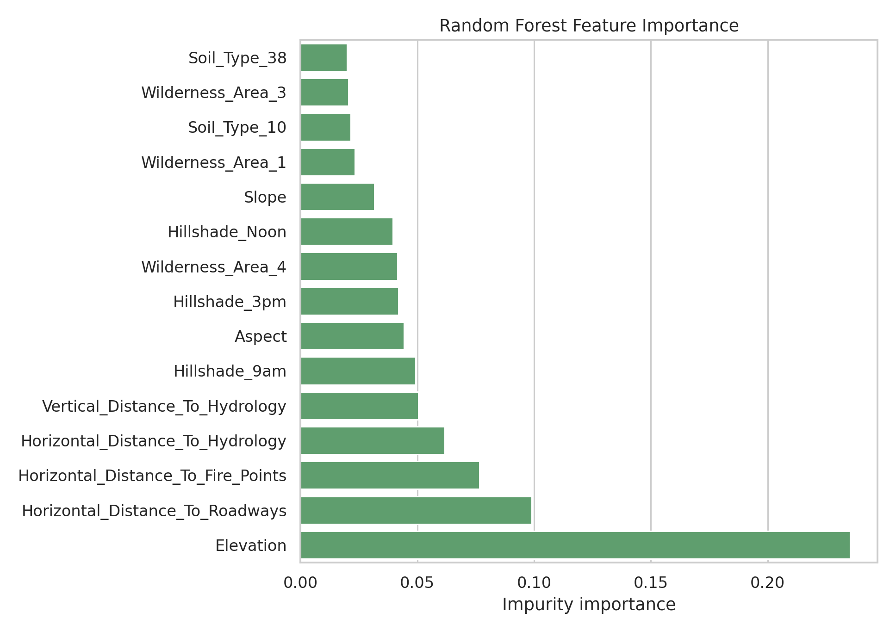{ width=5.4in }

## 6.2 Feature Group Ablation

Ablation with HistGradientBoosting shows that topographic variables alone are already strong, but adding soil indicators nearly recovers the all-feature model. Wilderness indicators alone are weak. This supports the interpretation that cover type is primarily driven by elevation, terrain geometry, hydrology/road/fire distances, and finer soil context.

| experiment | n_features | accuracy | f1_macro | AUC_ovr_macro | f1_macro_drop_vs_all |
| --- | --- | --- | --- | --- | --- |
| All features | 54 | 0.857 | 0.815 | 0.983 | 0.000 |
| Topographic + soil | 50 | 0.850 | 0.807 | 0.981 | 0.008 |
| Topographic + wilderness | 14 | 0.837 | 0.784 | 0.973 | 0.031 |
| Topographic only | 10 | 0.820 | 0.764 | 0.973 | 0.051 |
| Soil only | 40 | 0.618 | 0.279 | 0.873 | 0.536 |
| Wilderness only | 4 | 0.535 | 0.203 | 0.741 | 0.612 |

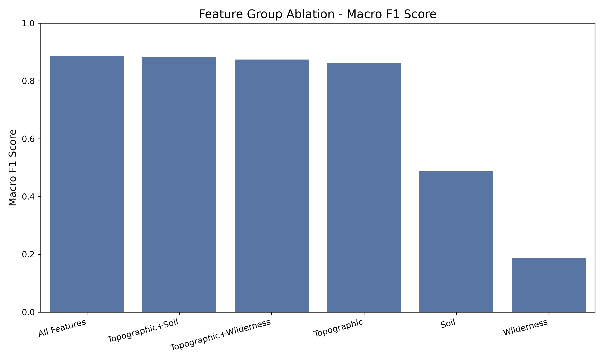{ width=5.7in }

## 6.3 Calibration, Terrain Robustness, and Error Cases

Calibration is measured with top-label confidence bins. HistGradientBoosting has the lowest expected calibration error, while Random Forest has the best accuracy and F1 but is under-confident on average: its mean confidence is below observed accuracy. This is acceptable for ranking and classification, but probability interpretation should use calibration checks.

| model | multiclass_brier | expected_calibration_error | mean_confidence | observed_accuracy |
| --- | --- | --- | --- | --- |
| HistGradientBoosting | 0.194 | 0.047 | 0.822 | 0.869 |
| Logistic Regression | 0.546 | 0.066 | 0.655 | 0.593 |
| Decision Tree | 0.324 | 0.104 | 0.880 | 0.775 |
| Random Forest | 0.178 | 0.128 | 0.775 | 0.902 |

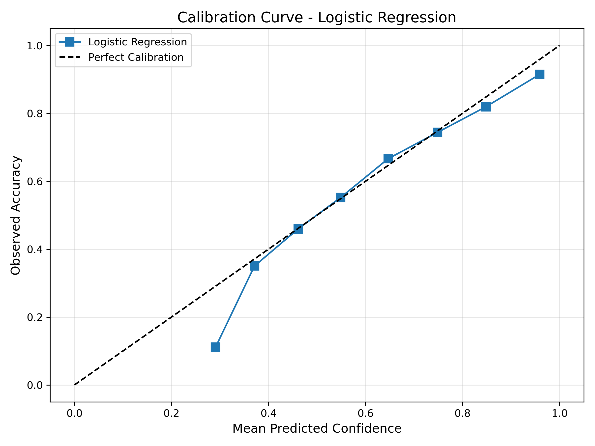{ width=5.0in }

The best model performs better in the highest elevation band than in lower bands, indicating that high-elevation classes are easier to separate. Error analysis also shows that incorrect predictions have much lower average top-class confidence than correct predictions, so confidence is useful for triaging uncertain cases.

| elevation_band | n | accuracy | f1_macro | dominant_true_class_name |
| --- | --- | --- | --- | --- |
| (1886.999, 2753.0] | 7217 | 0.874 | 0.783 | Lodgepole Pine |
| (2753.0, 2939.0] | 7238 | 0.894 | 0.773 | Lodgepole Pine |
| (2939.0, 3058.0] | 7164 | 0.893 | 0.822 | Lodgepole Pine |
| (3058.0, 3198.0] | 7194 | 0.914 | 0.823 | Spruce/Fir |
| (3198.0, 3856.0] | 7187 | 0.938 | 0.922 | Spruce/Fir |

| correct | count | mean | median | min | max |
| --- | --- | --- | --- | --- | --- |
| False | 3515 | 0.595 | 0.576 | 0.254 | 0.965 |
| True | 32485 | 0.794 | 0.821 | 0.290 | 0.999 |

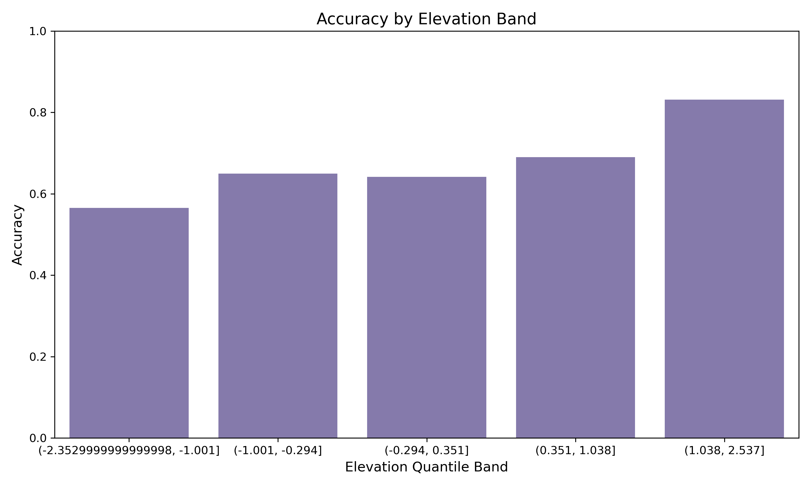{ width=5.2in }

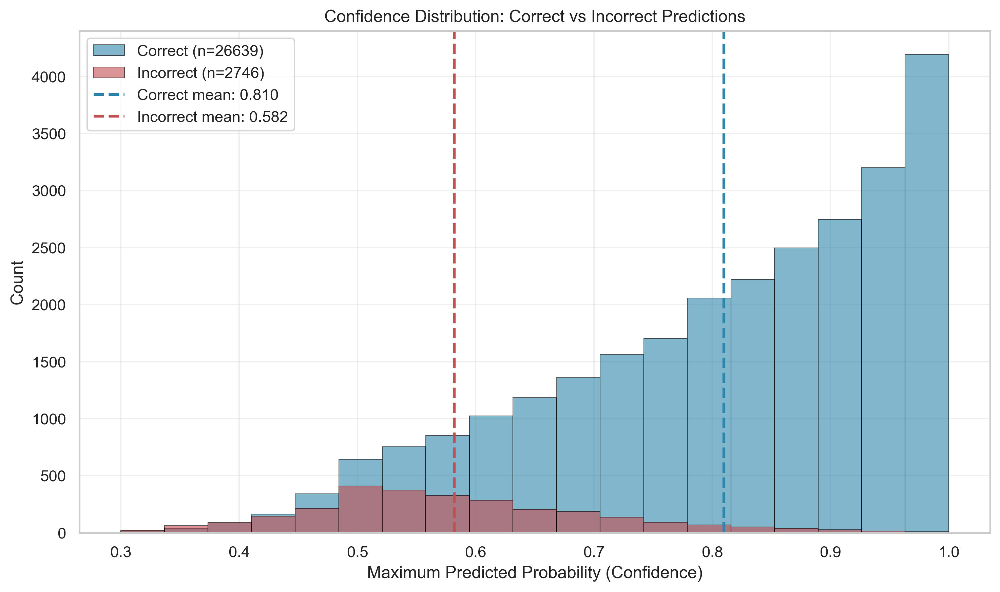{ width=5.0in }

Class-level recall confirms that minority and ecologically adjacent classes are harder than the two dominant classes.

| Cover_Type | Cover_Type_Name | support | precision | recall | f1 |
| --- | --- | --- | --- | --- | --- |
| 1 | Spruce/Fir | 13126 | 0.919 | 0.885 | 0.901 |
| 2 | Lodgepole Pine | 17554 | 0.907 | 0.930 | 0.918 |
| 3 | Ponderosa Pine | 2215 | 0.852 | 0.924 | 0.887 |
| 4 | Cottonwood/Willow | 170 | 0.782 | 0.824 | 0.802 |
| 5 | Aspen | 588 | 0.792 | 0.639 | 0.707 |
| 6 | Douglas-fir | 1076 | 0.796 | 0.778 | 0.787 |
| 7 | Krummholz | 1271 | 0.920 | 0.901 | 0.911 |

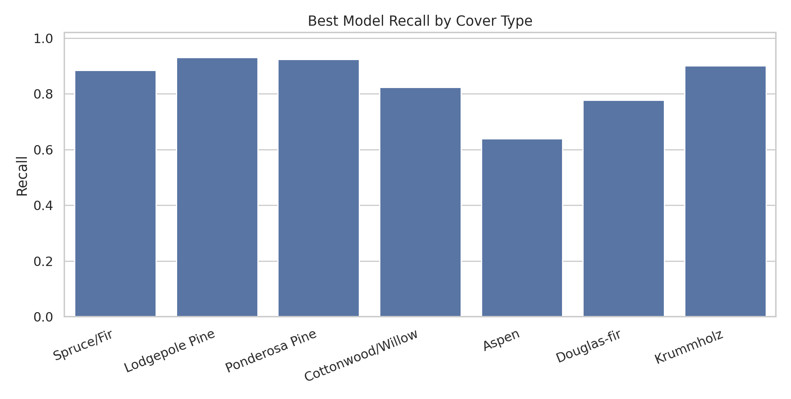{ width=5.4in }

## 6.4 Computational Cost and Scalable Optimization

Covertype is large enough that model training is feasible, but several standard analysis steps become expensive if applied naively to all 581,012 rows. Full-data t-SNE, full-data Ward clustering, exhaustive grid search, and full permutation importance are the main computational risks. The optimized workflow now implements dtype downcasting, manifest-based caches for heavy stages, stratified samples for expensive visualization/validation, PCA before distance-based analysis, MiniBatchKMeans for scalable clustering, and parallel tree ensembles for prediction. The naive all-int64 memory estimate is 243.8 MB; the optimized dataframe uses about 47.1 MB, a 80.7% reduction.

| module | scope | cost_score | optimization |
| --- | --- | --- | --- |
| Data read and preprocessing | full 581,012 rows x 54 features | 1 | implemented dtype downcast from naive 243.8 MB to 47.1 MB |
| Standardization and PCA | 6,000-120,000 stratified rows | 2 | apply PCA before t-SNE and clustering |
| t-SNE visualization | 6,000 stratified rows after PCA | 9 | use stratified sample plus PCA; UMAP is a possible faster substitute |
| MiniBatchKMeans clustering | 6,000 stratified rows after PCA | 3 | implemented MiniBatchKMeans with fixed batch size for scalable clustering |
| Ward hierarchical clustering | 2,500 stratified rows | 10 | restrict to small sample or replace with BIRCH/MiniBatchKMeans |
| Supervised model training | 120,000 stratified rows, 70/30 split | 6 | use n_jobs=-1, bounded tree complexity, and efficient boosting |
| Cross-validation | 36,000 stratified rows x 3 folds | 7 | use 3-fold sample CV; tune on sample, then train final model |
| Permutation importance | 8,000 test rows x 54 features x 5 repeats | 8 | combine cheap impurity importance with sampled permutation checks |

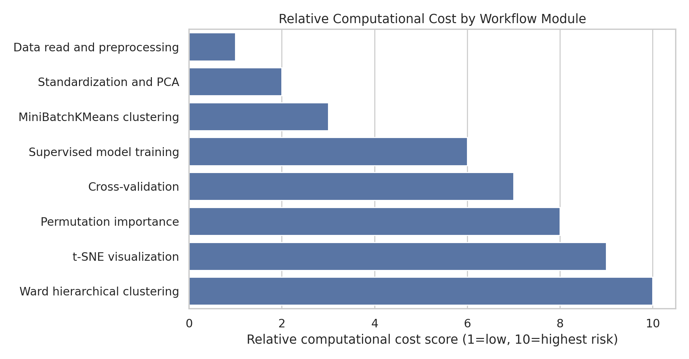{ width=5.6in }

The run profile records whether each stage was computed or recovered from cache.

| stage | seconds | cache_status |
| --- | --- | --- |
| data_read_downcast | 0.89 | computed |
| descriptive_outputs | 0.69 | computed |
| computational_cost_outputs | 0.20 | computed |
| t-SNE | 0.00 | cache_hit |
| clustering | 0.00 | cache_hit |
| modeling | 0.01 | cache_hit |

The optimization directions can be grouped as follows.

| category | action | benefit |
| --- | --- | --- |
| Data types and I/O | Implemented uint8 indicators/target, float32 continuous variables, and cached prepared files | Lower memory pressure and faster repeated runs |
| Sampling strategy | Use stratified samples for t-SNE, Ward clustering, CV, and permutation importance | Stable estimates without quadratic or repeated full-data costs |
| Dimensionality reduction | Run PCA to 20-30 components before t-SNE and clustering | Faster visualizations and more stable distance-based structure |
| Scalable clustering | Implemented MiniBatchKMeans for scalable clustering; kept Ward for small structural samples | Maintains clustering analysis without infeasible memory growth |
| Model training | Use parallel Random Forest, HistGradientBoosting, class weights, and bounded tree complexity | High accuracy and macro-F1 with controlled runtime |
| Validation and tuning | Use 3-fold CV, RandomizedSearchCV or halving search on samples, then train final parameters once | Comparable model ranking at a fraction of full-grid cost |
| Interpretability | Use tree impurity importance first; run permutation importance on a small held-out sample | Good feature diagnostics with bounded prediction calls |
| Caching and reproducibility | Implemented manifest-based caches for t-SNE, clustering, and modeling outputs | Fast report/PPT rebuilds and auditable intermediate artifacts |

# Conclusion

The Covertype dataset has strong class imbalance and substantial overlap between ecological classes. Unsupervised clustering reveals broad terrain structure but does not recover the true seven labels. Supervised tree ensembles are much more effective: Random Forest gives the best overall classification performance, while HistGradientBoosting offers better calibration. Elevation is the most important single feature, but soil indicators and distance-to-road/fire/hydrology variables add meaningful predictive value. Computationally, the safest strategy is to combine full-data descriptive analysis, stratified samples for expensive diagnostics, PCA for distance-based methods, and parallel ensemble models. For practical use, the model should report macro metrics, class-level recall, calibration, terrain-band performance, and the sampling assumptions behind expensive steps.

# References

1. UCI Machine Learning Repository. Covertype dataset. https://archive.ics.uci.edu/ml/datasets/covertype
2. Blackard, Jock A. and Dean, Denis J. Comparative Accuracies of Artificial Neural Networks and Discriminant Analysis in Predicting Forest Cover Types from Cartographic Variables. Computers and Electronics in Agriculture, 1999.
3. Pedregosa et al. Scikit-learn: Machine Learning in Python. Journal of Machine Learning Research, 2011.
4. van der Maaten and Hinton. Visualizing Data using t-SNE. Journal of Machine Learning Research, 2008.

# Credit

Code, figures, and report text were generated reproducibly in this repository. Group-member contribution details should be filled in by the project team before submission. OpenAI Codex was used to draft and validate the analysis workflow and report.
