# Introduction

本项目基于 UCI 的 **Predict Students' Dropout and Academic Success** 数据集完成 DSAA2011 项目要求。数据包含 4424 名本科学生、36 个原始特征，目标变量为 Dropout、Enrolled 与 Graduate，其中 Dropout=1421、Enrolled=794、Graduate=2209。项目先用无监督方法观察高维结构，再将任务转化为 Dropout 与 Graduate 二分类，以便建立可解释的辍学预警模型。

# 1. Data Preprocessing

缺失值检查显示最大缺失率为 0.00%，没有列超过 40% 阈值，因此未删除特征。数值型变量使用中位数填充，类别型变量使用众数填充；18 个类别变量经独热编码处理，其中 Application mode, Course, Father's occupation, Father's qualification, Mother's occupation, Mother's qualification, Nacionality, Previous qualification 等高基数变量只保留 Top 5 类别，其余归为 Other。标准化前特征矩阵为 [4424, 36]，处理后为 [4424, 96]。该流程兼顾异常值鲁棒性、类别变量可建模性和不同量纲特征的可比性。

# 2. Data Visualization: t-SNE

t-SNE 使用 perplexity=30、learning_rate=200、random_state=42。二维嵌入显示三类样本存在局部聚集，但整体交叠明显：Dropout 在若干区域密度较高，Graduate 在中心和右下区域较集中，Enrolled 常落在两者之间。这说明学生状态与早期学业、经济和人口统计变量相关，但并不存在简单线性边界。Enrolled 标签代表尚未结束的学业过程，其混合分布也支持后续二分类中剔除该类的决定。

# 3. Clustering Analysis

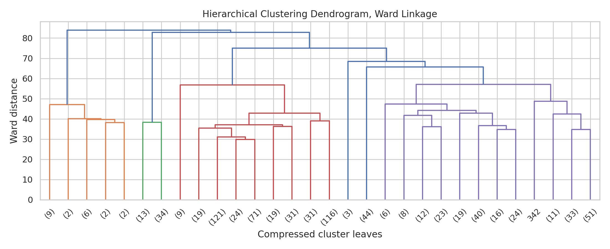

K-Means 与 Ward 层次聚类均在 K=2 至 8 中搜索，K-Means 用肘部法则和轮廓系数选择 K，层次聚类结合树状图和轮廓系数。结果如下：

| algorithm | k | silhouette | calinski_harabasz | ARI_vs_Target |
| --- | --- | --- | --- | --- |
| K-Means | 2 | 0.111 | 233.633 | 0.072 |
| Agglomerative Ward | 2 | 0.411 | 193.517 | 0.001 |

层次聚类的 silhouette=0.411，内部距离分离较强；但其 ARI 仅 0.001，几乎不能复现真实学业结局。K-Means 的 CH 指数和 ARI 更高，虽 silhouette 较低，但与 Target 的对应关系更强。因此若目标是辅助理解学生结果结构，K-Means 更有实用价值；若只看内部距离分离，Ward 层次聚类更占优。

# 4. Prediction: Training and Testing

监督学习将 Target 转为二分类：Dropout 为正类，Graduate 为负类。Enrolled 样本被剔除，因为该类学生最终结果尚不明确，作为监督标签会降低模型置信度。二分类数据包含 Graduate=2209、Dropout=1421，采用 70%/30% 分层抽样。逻辑回归作为稳定线性基线，决策树设置 max_depth=5 以限制过拟合。测试集混淆矩阵显示逻辑回归漏判 Dropout 50 人，决策树漏判 84 人，逻辑回归更适合辍学预警。

# 5. Evaluation and Model Choice

测试集指标如下：

| model | accuracy | precision | recall | f1 | AUC |
| --- | --- | --- | --- | --- | --- |
| Logistic Regression | 0.923 | 0.917 | 0.883 | 0.900 | 0.964 |
| Decision Tree | 0.894 | 0.917 | 0.803 | 0.856 | 0.906 |

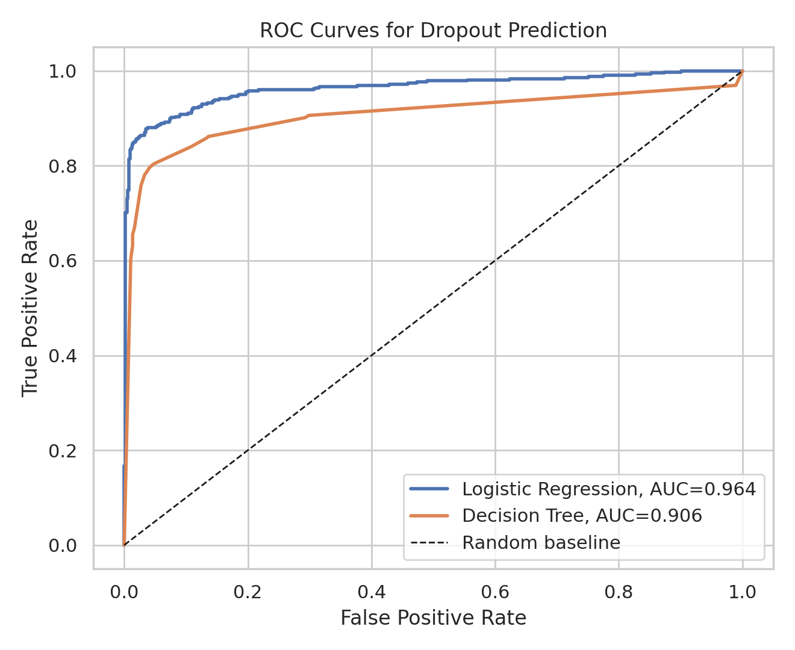

逻辑回归在 Accuracy=0.923、Recall=0.883、F1=0.900、AUC=0.964 上均优于或明显优于决策树。5 折交叉验证结果如下：

| model | train_accuracy | test_accuracy | cv_auc_mean | cv_auc_std | train_test_gap |
| --- | --- | --- | --- | --- | --- |
| Logistic Regression | 0.910 | 0.923 | 0.951 | 0.006 | -0.013 |
| Decision Tree | 0.913 | 0.894 | 0.914 | 0.004 | 0.019 |

逻辑回归训练准确率 0.910，测试准确率 0.923，泛化稳定。决策树训练准确率 0.913，测试准确率 0.894，差距不大但 Recall 偏低。综合 AUC、Recall 与交叉验证稳定性，逻辑回归是本任务中最合适的简单模型。

# 6. Open-ended Exploration

## 6.1 Feature Importance and Model Comparison

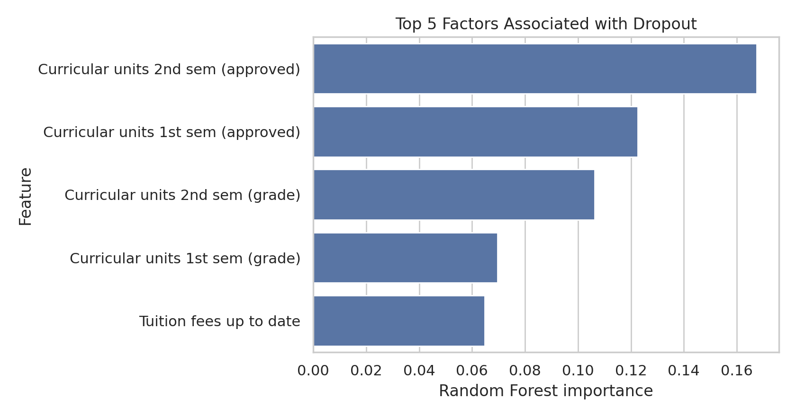

随机森林 impurity importance 的 Top 5 如下：

| original_feature | importance |
| --- | --- |
| Curricular units 2nd sem (approved) | 0.168 |
| Curricular units 1st sem (approved) | 0.123 |
| Curricular units 2nd sem (grade) | 0.106 |
| Curricular units 1st sem (grade) | 0.070 |
| Tuition fees up to date | 0.065 |

随机森林使用 GridSearchCV 调整 n_estimators、max_depth 与 min_samples_leaf，最佳参数为 `{'rf__max_depth': None, 'rf__min_samples_leaf': 1, 'rf__n_estimators': 300}`。三类模型测试集表现如下：

| model | accuracy | precision | recall | f1 | AUC |
| --- | --- | --- | --- | --- | --- |
| Logistic Regression | 0.923 | 0.917 | 0.883 | 0.900 | 0.964 |
| Random Forest, tuned | 0.921 | 0.936 | 0.857 | 0.895 | 0.958 |
| Decision Tree | 0.894 | 0.917 | 0.803 | 0.856 | 0.906 |

调参随机森林 AUC=0.958，优于决策树但略低于逻辑回归。该结果说明本数据中辍学与毕业之间存在较强的近线性可分信号，复杂模型未必带来更高泛化收益。

## 6.2 Class Imbalance and SMOTE

二分类任务的少数类/多数类比例为 0.643，存在中等不平衡。SMOTE 结果如下：

| model | precision | recall | f1 | AUC | AUC_delta_vs_baseline |
| --- | --- | --- | --- | --- | --- |
| Logistic Regression + SMOTE | 0.875 | 0.904 | 0.889 | 0.963 | -0.001 |
| Decision Tree + SMOTE | 0.860 | 0.833 | 0.846 | 0.926 | 0.020 |

SMOTE 将逻辑回归 Recall 从 0.883 提升到 0.904，但 Precision 与 AUC 略降；对决策树，AUC 提升约 0.020。若实际场景重视少漏报，SMOTE 值得考虑；若强调整体排序能力，原始逻辑回归已足够稳健。

## 6.3 Early Warning Experiment

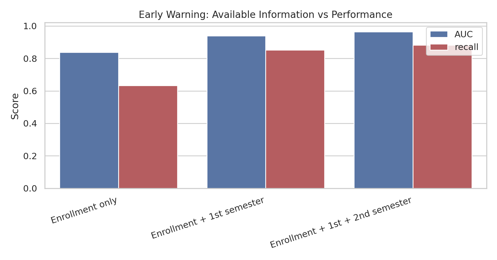

早期预警实验严格控制信息可用时间点。只使用入学时已知信息时，AUC=0.838、Recall=0.634；加入第一学期表现后，AUC 提升到 0.939、Recall 提升到 0.852；再加入第二学期后，AUC=0.964、Recall=0.883。这说明第一学期信息已经提供了大部分预测增益，第二学期继续提升但边际收益较小。从教育干预角度，第一学期结束后建模比等到第二学期结束更有实际价值。

| experiment | n_raw_features | accuracy | precision | recall | f1 | AUC | AUC_gain_vs_enrollment_only |
| --- | --- | --- | --- | --- | --- | --- | --- |
| Enrollment only | 24 | 0.769 | 0.738 | 0.634 | 0.682 | 0.838 | 0.000 |
| Enrollment + 1st semester | 30 | 0.902 | 0.892 | 0.852 | 0.872 | 0.939 | 0.101 |
| Enrollment + 1st + 2nd semester | 36 | 0.923 | 0.917 | 0.883 | 0.900 | 0.964 | 0.126 |

## 6.3.1 Prediction Time Matters

| experiment | n_raw_features | AUC | recall | precision | f1 | interpretation | leakage_risk_for_early_intervention |
| --- | --- | --- | --- | --- | --- | --- | --- |
| Enrollment only | 24 | 0.838 | 0.634 | 0.738 | 0.682 | Pre-enrollment screening; useful for planning, weak for precise intervention. | Low |
| Enrollment + 1st semester | 30 | 0.939 | 0.852 | 0.892 | 0.872 | Actionable early warning; available after first-semester outcomes. | Low |
| Enrollment + 1st + 2nd semester | 36 | 0.964 | 0.883 | 0.917 | 0.900 | Retrospective diagnosis; strongest accuracy but may be late for prevention. | High if claimed as early warning |

若报告声称“早期预警”，则不能使用第二学期结束后的表现作为输入，否则存在时间泄漏。完整模型 AUC 最高，但它回答的是“哪些学生最终更像辍学者”的回顾性诊断问题；第一学期模型回答的是“还有时间干预时，哪些学生值得优先关注”的管理问题。因此，本项目在部署建议中优先使用 `Enrollment + 1st semester` 模型，在技术上保留 full model 作为上界参考。

## 6.4 Feature Ablation

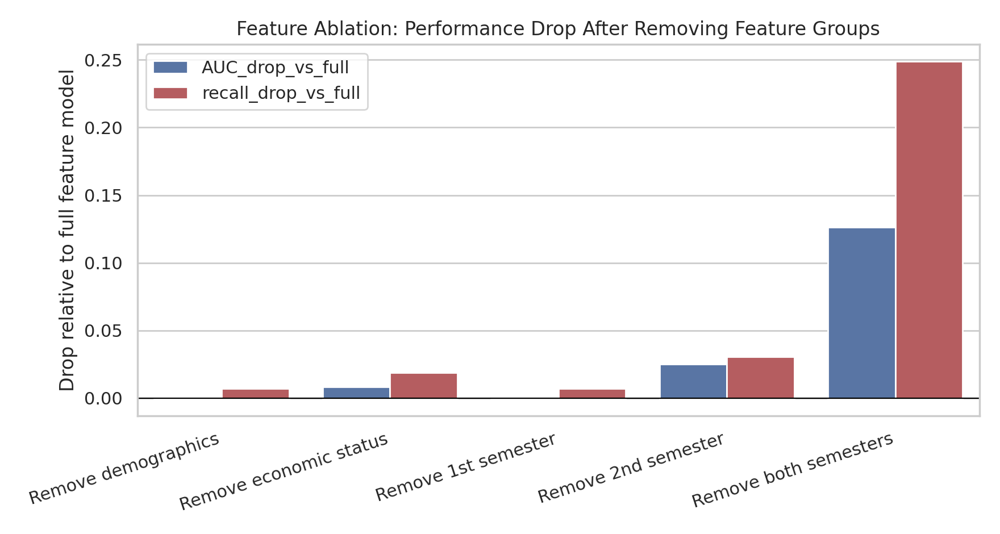

消融实验从完整特征集中按组删除人口统计、经济状态、第一学期和第二学期特征。结果显示，删除第二学期特征使 AUC 下降 0.025，删除两个学期特征使 AUC 下降 0.126、Recall 下降 0.249。经济状态删除后 AUC 下降 0.009，说明缴费、欠费、奖学金和宏观经济变量有辅助价值。人口统计变量删除后几乎不降低 AUC，不应被过度解读为主要风险来源。

| experiment | n_raw_features | AUC | recall | AUC_drop_vs_full | recall_drop_vs_full |
| --- | --- | --- | --- | --- | --- |
| Full features | 36 | 0.964 | 0.883 | 0.000 | 0.000 |
| Remove demographics | 29 | 0.964 | 0.876 | -0.000 | 0.007 |
| Remove economic status | 30 | 0.956 | 0.864 | 0.009 | 0.019 |
| Remove 1st semester | 30 | 0.964 | 0.876 | 0.000 | 0.007 |
| Remove 2nd semester | 30 | 0.939 | 0.852 | 0.025 | 0.031 |
| Remove both semesters | 24 | 0.838 | 0.634 | 0.126 | 0.249 |

## 6.5 Threshold Tuning and Intervention Strategy

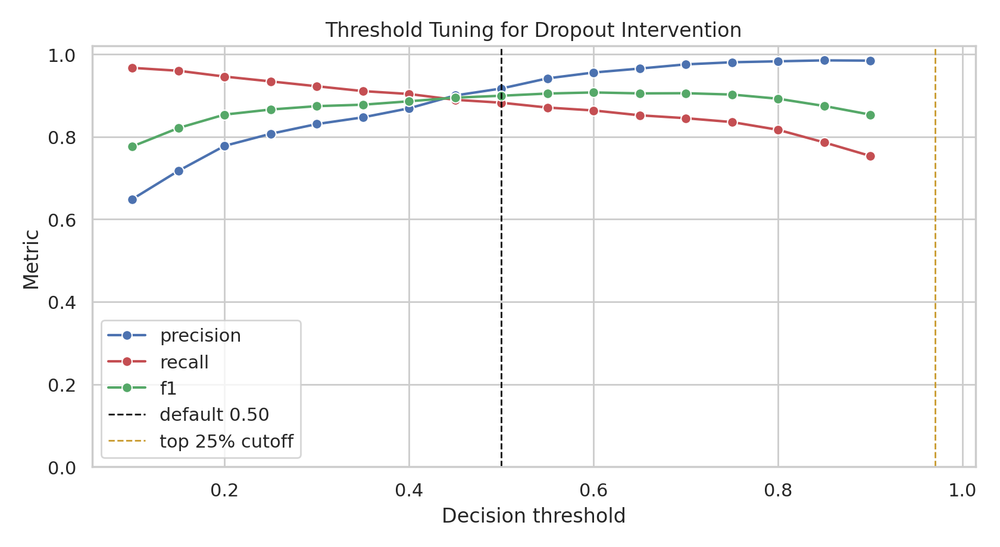

默认阈值 0.5 并不一定符合学校资源约束。若设定“每 100 名学生最多人工跟进 25 人”，最合理策略是按模型风险分从高到低排序并跟进前 25%。在测试集中该策略标记 272 人，Precision=0.996、Recall=0.636、F1=0.777。这意味着少量人工资源可以优先覆盖最高风险学生，但会牺牲一部分 Recall；若目标是尽量少漏报，则应降低阈值并接受更多人工审核。

## 6.5.1 Intervention Coverage Curve

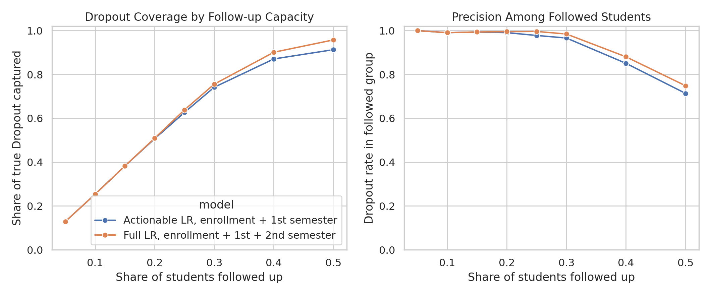

干预覆盖曲线直接回答“跟进多少学生能覆盖多少真实 Dropout”。使用第一学期可行动模型时，跟进风险最高的 25% 学生可覆盖 62.68% 的真实 Dropout，跟进名单中的 Dropout 比例为 97.80%；使用包含第二学期信息的完整模型时，对应覆盖率为 63.85%。两者在前 25% 容量下差距不大，说明第一学期模型已经足以支持实际干预排序，而第二学期模型更适合作为回顾性诊断。

| model | follow_up_rate | follow_up_count | captured_dropout | dropout_coverage | precision_among_followed | lift_vs_random |
| --- | --- | --- | --- | --- | --- | --- |
| Actionable LR, enrollment + 1st semester | 0.050 | 55 | 55 | 0.129 | 1.000 | 2.556 |
| Actionable LR, enrollment + 1st semester | 0.100 | 109 | 108 | 0.254 | 0.991 | 2.533 |
| Actionable LR, enrollment + 1st semester | 0.150 | 164 | 163 | 0.383 | 0.994 | 2.541 |
| Actionable LR, enrollment + 1st semester | 0.200 | 218 | 216 | 0.507 | 0.991 | 2.533 |
| Actionable LR, enrollment + 1st semester | 0.250 | 273 | 267 | 0.627 | 0.978 | 2.500 |
| Actionable LR, enrollment + 1st semester | 0.300 | 327 | 316 | 0.742 | 0.966 | 2.470 |
| Actionable LR, enrollment + 1st semester | 0.400 | 436 | 371 | 0.871 | 0.851 | 2.175 |
| Actionable LR, enrollment + 1st semester | 0.500 | 545 | 389 | 0.913 | 0.714 | 1.825 |
| Full LR, enrollment + 1st + 2nd semester | 0.050 | 55 | 55 | 0.129 | 1.000 | 2.556 |
| Full LR, enrollment + 1st + 2nd semester | 0.100 | 109 | 108 | 0.254 | 0.991 | 2.533 |
| Full LR, enrollment + 1st + 2nd semester | 0.150 | 164 | 163 | 0.383 | 0.994 | 2.541 |
| Full LR, enrollment + 1st + 2nd semester | 0.200 | 218 | 217 | 0.509 | 0.995 | 2.545 |
| Full LR, enrollment + 1st + 2nd semester | 0.250 | 273 | 272 | 0.638 | 0.996 | 2.547 |
| Full LR, enrollment + 1st + 2nd semester | 0.300 | 327 | 322 | 0.756 | 0.985 | 2.517 |
| Full LR, enrollment + 1st + 2nd semester | 0.400 | 436 | 384 | 0.901 | 0.881 | 2.251 |
| Full LR, enrollment + 1st + 2nd semester | 0.500 | 545 | 408 | 0.958 | 0.749 | 1.914 |

## 6.6 Permutation Importance

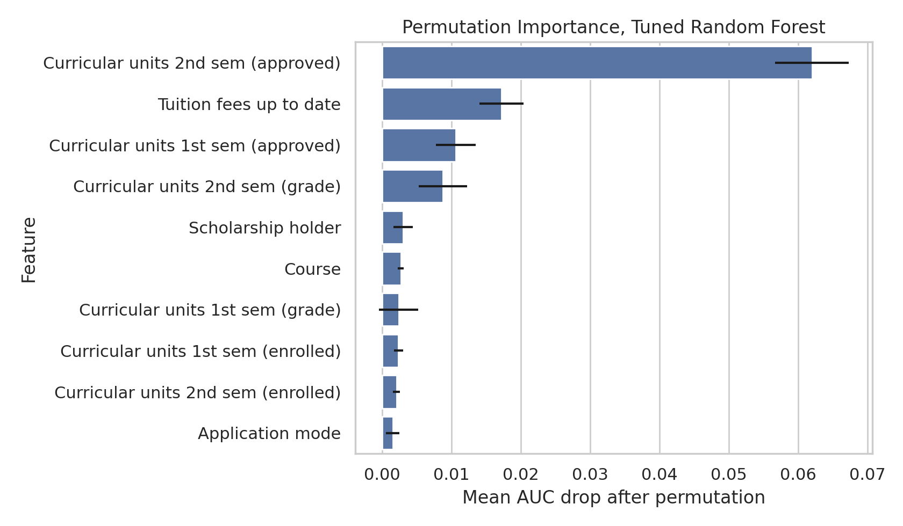

由于 impurity importance 对高基数独热特征可能存在偏差，本项目额外使用 permutation importance，以测试集 AUC 下降衡量原始特征贡献。结果如下：

| feature | importance_mean_auc_drop | importance_std |
| --- | --- | --- |
| Curricular units 2nd sem (approved) | 0.062 | 0.005 |
| Tuition fees up to date | 0.017 | 0.003 |
| Curricular units 1st sem (approved) | 0.011 | 0.003 |
| Curricular units 2nd sem (grade) | 0.009 | 0.003 |
| Scholarship holder | 0.003 | 0.001 |
| Course | 0.003 | 0.000 |
| Curricular units 1st sem (grade) | 0.002 | 0.003 |
| Curricular units 1st sem (enrolled) | 0.002 | 0.001 |

Permutation importance 仍将第二学期通过课程数列为最重要特征，置乱后 AUC 平均下降 0.062；`Tuition fees up to date` 的 AUC 下降为 0.017，进一步支持“学业表现 + 经济状态”双重解释。

## 6.7 Fairness Check

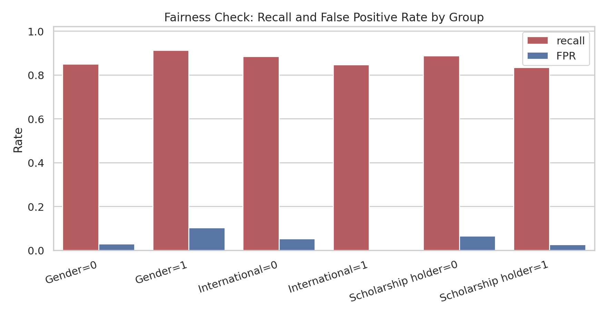

按 Gender、International 和 Scholarship holder 分组后，逻辑回归在不同群体上的 Recall 和 FPR 存在差异：

| sensitive_feature | group_value | n | positives_dropout | recall | FPR | precision | mean_predicted_risk |
| --- | --- | --- | --- | --- | --- | --- | --- |
| Gender | 0 | 669 | 199 | 0.849 | 0.030 | 0.923 | 0.317 |
| Gender | 1 | 420 | 227 | 0.912 | 0.104 | 0.912 | 0.571 |
| International | 0 | 1062 | 413 | 0.884 | 0.052 | 0.915 | 0.414 |
| International | 1 | 27 | 13 | 0.846 | 0.000 | 1.000 | 0.445 |
| Scholarship holder | 0 | 822 | 390 | 0.887 | 0.065 | 0.925 | 0.492 |
| Scholarship holder | 1 | 267 | 36 | 0.833 | 0.026 | 0.833 | 0.179 |

Gender=1 的 Recall=0.912，高于 Gender=0 的 0.849，但其 FPR 也更高。Scholarship holder=1 的 Recall=0.833，低于非奖学金组。International=1 的样本仅 27 人，结论应谨慎。若模型部署为真实预警系统，应继续做群体校准和人工复核。

## 6.7.1 Fairness Bootstrap Confidence Intervals

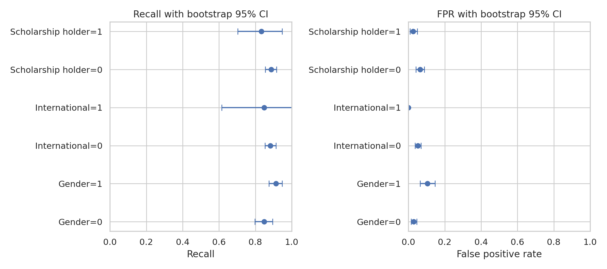

在 Wilson 区间之外，本项目还对每个敏感群体内的 Recall 和 FPR 做 bootstrap。International=1 组只有 27 个测试样本，其 Recall bootstrap 95% CI 为 [0.615, 1.000]。这进一步说明，小样本群体的公平性指标不应只看点估计；真实部署时需要持续积累样本并周期性重估。

| sensitive_feature | group_value | n | recall_bootstrap_mean | recall_ci_low | recall_ci_high | FPR_bootstrap_mean | FPR_ci_low | FPR_ci_high |
| --- | --- | --- | --- | --- | --- | --- | --- | --- |
| Gender | 0 | 669 | 0.849 | 0.798 | 0.896 | 0.029 | 0.015 | 0.046 |
| Gender | 1 | 420 | 0.913 | 0.874 | 0.948 | 0.104 | 0.065 | 0.146 |
| International | 0 | 1062 | 0.883 | 0.853 | 0.913 | 0.052 | 0.036 | 0.069 |
| International | 1 | 27 | 0.848 | 0.615 | 1.000 | 0.000 | 0.000 | 0.000 |
| Scholarship holder | 0 | 822 | 0.887 | 0.855 | 0.917 | 0.064 | 0.042 | 0.087 |
| Scholarship holder | 1 | 267 | 0.833 | 0.704 | 0.947 | 0.026 | 0.008 | 0.049 |

## 6.8 Reusing Enrolled Students as Risk-scoring Cases

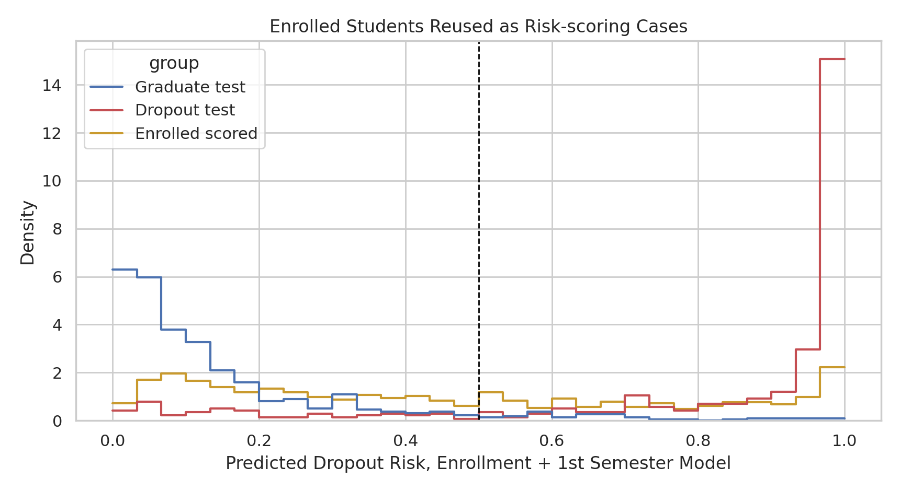

Enrolled 样本不适合作为监督训练标签，但可用“入学 + 第一学期”模型打风险分。794 名 Enrolled 学生的平均风险为 0.452，中位数为 0.400；其中 333 人风险分不低于 0.5，占 41.94%。若采用早期模型在测试集上的 top-25% 阈值 0.915，Enrolled 中仍有 95 人进入高优先级干预名单，占 11.96%。风险分桶如下：

| risk_bucket | count |
| --- | --- |
| low_<0.25 | 284 |
| very_high_>=0.75 | 185 |
| medium_0.25-0.50 | 177 |
| high_0.50-0.75 | 148 |

## 6.9 Calibration and Brier Score

为了判断风险分是否可解释为概率，本项目绘制校准曲线并计算 Brier score。结果如下：

| model | brier_score | expected_calibration_error | max_calibration_error | mean_predicted_risk | observed_dropout_rate |
| --- | --- | --- | --- | --- | --- |
| Logistic Regression | 0.058 | 0.031 | 0.223 | 0.415 | 0.391 |
| Decision Tree | 0.089 | 0.025 | 0.150 | 0.400 | 0.391 |
| Random Forest, tuned | 0.068 | 0.062 | 0.206 | 0.403 | 0.391 |

逻辑回归的 Brier score=0.058，低于决策树和调参随机森林，说明其概率输出更适合直接解释为辍学风险。其 expected calibration error=0.031，整体校准较好，但校准曲线在中高风险区仍有偏差。因此在真实部署中，风险分可以用于排序和分层，但不应机械地解释为完全准确的个人概率。

## 6.9.1 Calibrated Models

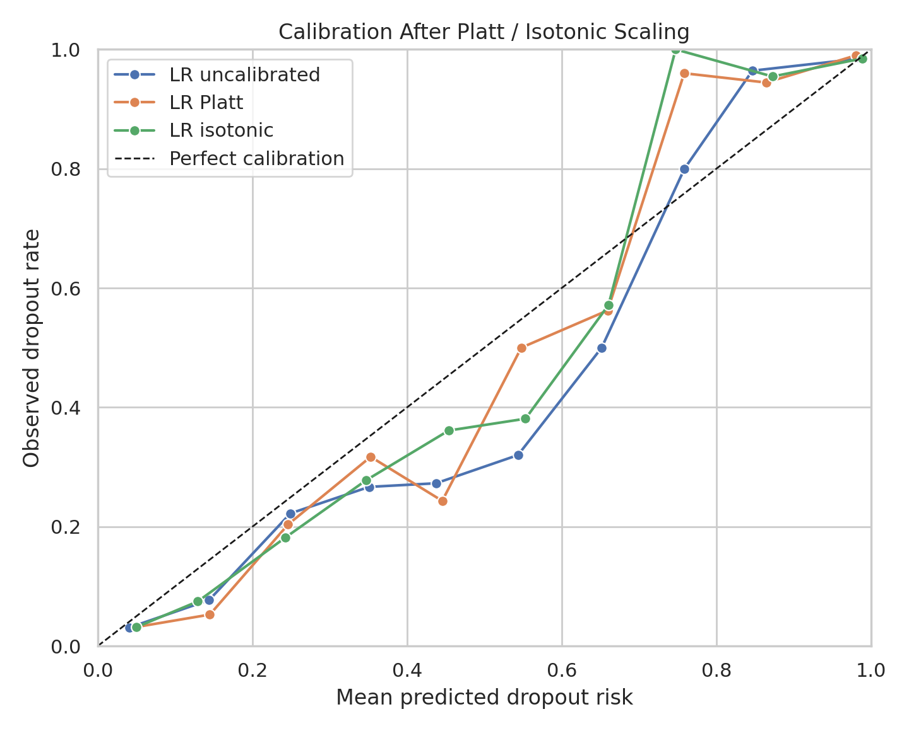

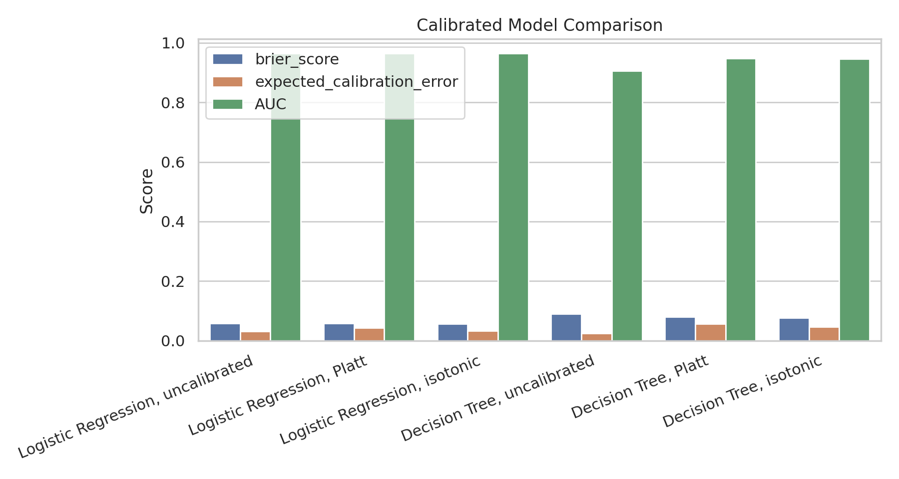

进一步使用 `CalibratedClassifierCV` 对逻辑回归和决策树进行 Platt scaling 与 isotonic calibration。结果如下：

| model | calibration_method | AUC | brier_score | expected_calibration_error | mean_predicted_risk |
| --- | --- | --- | --- | --- | --- |
| Logistic Regression, uncalibrated | none | 0.964 | 0.058 | 0.031 | 0.415 |
| Logistic Regression, Platt | sigmoid | 0.964 | 0.059 | 0.042 | 0.414 |
| Logistic Regression, isotonic | isotonic | 0.965 | 0.057 | 0.033 | 0.416 |
| Decision Tree, uncalibrated | none | 0.906 | 0.089 | 0.025 | 0.400 |
| Decision Tree, Platt | sigmoid | 0.948 | 0.079 | 0.056 | 0.402 |
| Decision Tree, isotonic | isotonic | 0.947 | 0.077 | 0.046 | 0.404 |

本次结果中，最佳 Brier score 来自 Logistic Regression, isotonic，为 0.057；最佳 ECE 来自 Decision Tree, uncalibrated，为 0.025。校准改善了部分概率质量，尤其是决策树的 Brier score，但校准方法也可能改变排序表现，因此部署时应同时报告 AUC、Brier 和 ECE，而不是只优化单一指标。

## 6.10 Partial Dependence and Counterfactual-style Discussion

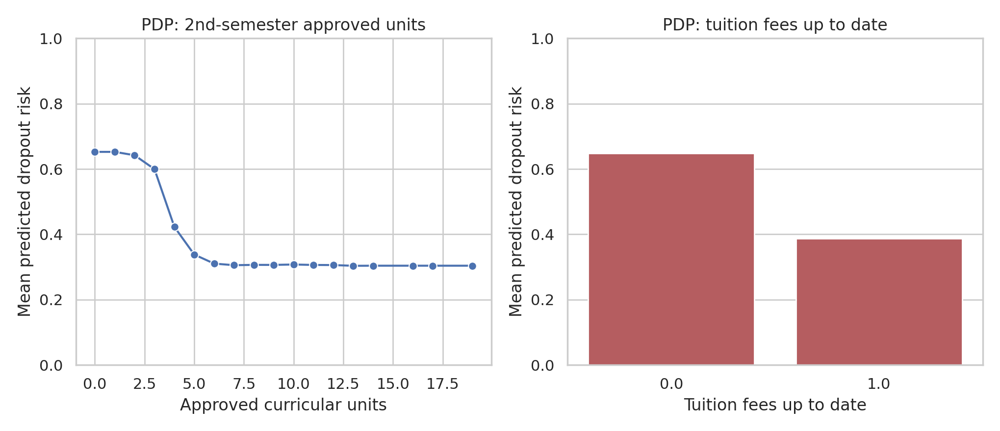

Partial dependence 显示，当 `Curricular units 2nd sem (approved)` 从 0 增至 6 时，随机森林平均预测风险由 0.652 降至 0.310；`Tuition fees up to date` 从 0 变为 1 时，平均风险由 0.648 降至 0.387。这支持“课程通过数量”和“学费状态”是关键风险信号，但 PDP 仍是模型解释，不等同于因果效应。

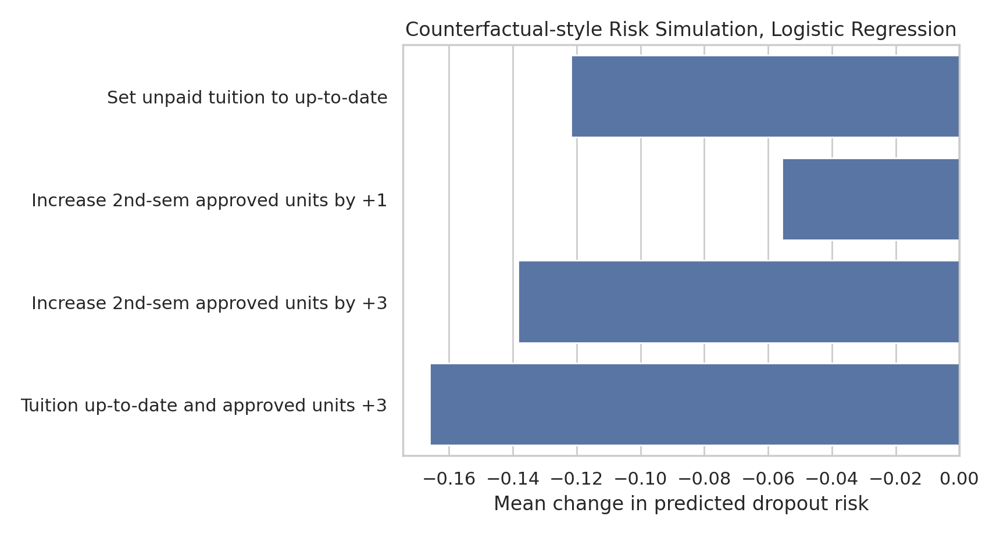

反事实风格模拟使用逻辑回归模型在测试集上修改单个或少量特征，观察预测风险变化：

| scenario | n_eligible | baseline_mean_risk_eligible | scenario_mean_risk_eligible | mean_delta_risk | pct_with_lower_risk |
| --- | --- | --- | --- | --- | --- |
| Set unpaid tuition to up-to-date | 154 | 0.941 | 0.819 | -0.122 | 1.000 |
| Increase 2nd-sem approved units by +1 | 1089 | 0.415 | 0.360 | -0.056 | 1.000 |
| Increase 2nd-sem approved units by +3 | 1089 | 0.415 | 0.277 | -0.138 | 1.000 |
| Tuition up-to-date and approved units +3 | 1089 | 0.415 | 0.249 | -0.166 | 1.000 |

模拟显示，将第二学期通过课程数增加 3 个单位时，平均预测风险下降 0.138；同时将学费状态设为按时缴纳并增加 3 个通过课程时，平均风险下降 0.166。这些结果适合用于形成教育干预假设，例如加强课程支持和学费援助，但不能替代随机实验或因果推断。

## 6.11 Deployment Uncertainty and Group-wise Calibration

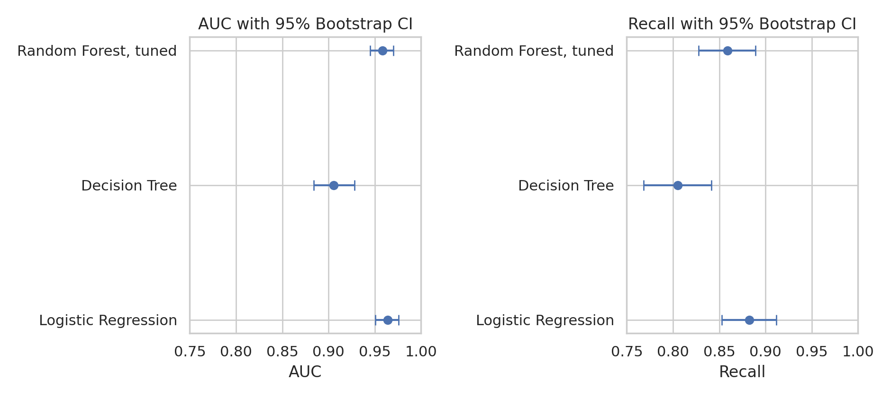

模型总体指标使用 1000 次 bootstrap 估计 95% 置信区间：

| model | AUC_95CI | Recall_95CI |
| --- | --- | --- |
| Logistic Regression | 0.964 [0.951, 0.976] | 0.883 [0.853, 0.912] |
| Decision Tree | 0.906 [0.884, 0.928] | 0.805 [0.768, 0.842] |
| Random Forest, tuned | 0.958 [0.945, 0.970] | 0.859 [0.828, 0.889] |

逻辑回归 AUC 的 95% CI 为 0.964 [0.951, 0.976]，Recall 的 95% CI 为 0.883 [0.853, 0.912]。这说明其总体性能较稳健，但 Recall 仍有不确定性。

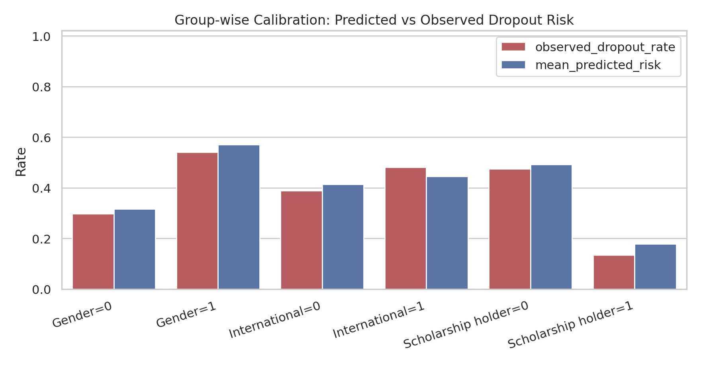

分组校准结果如下：

| sensitive_feature | group_value | n | observed_dropout_rate | mean_predicted_risk | calibration_gap_pred_minus_observed | brier_score |
| --- | --- | --- | --- | --- | --- | --- |
| Gender | 0 | 669 | 0.297 | 0.317 | 0.020 | 0.055 |
| Gender | 1 | 420 | 0.540 | 0.571 | 0.031 | 0.064 |
| International | 0 | 1062 | 0.389 | 0.414 | 0.026 | 0.059 |
| International | 1 | 27 | 0.481 | 0.445 | -0.037 | 0.045 |
| Scholarship holder | 0 | 822 | 0.474 | 0.492 | 0.018 | 0.065 |
| Scholarship holder | 1 | 267 | 0.135 | 0.179 | 0.044 | 0.038 |

International=1 组仅 27 人，Recall=0.846，Wilson 95% CI 为 [0.578, 0.957]；FPR=0.000，但 95% CI 上界达到 0.215。这说明小样本群体的点估计不可过度解读。部署时应报告不确定性、进行人工复核，并在积累更多样本后重新评估群体校准。

## 6.12 False Negative Profile

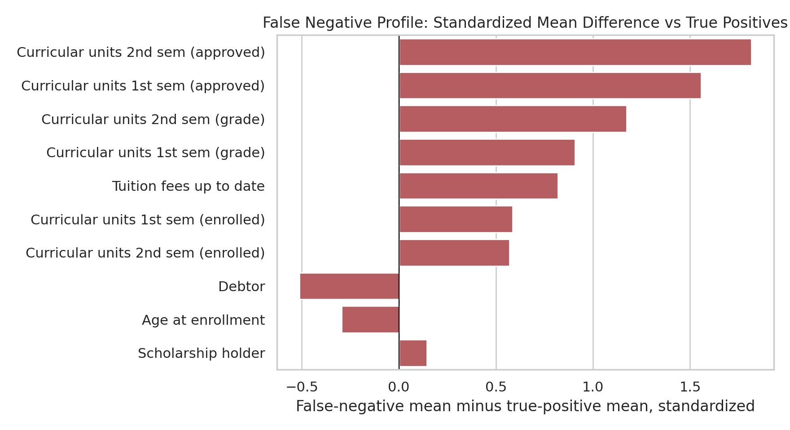

最后分析逻辑回归在测试集上漏判的 Dropout。模型共漏判 50 名 Dropout，正确识别 376 名 Dropout。漏判样本最突出的特征差异是 `Curricular units 2nd sem (approved)`：漏判组均值为 5.720，正确识别组均值为 1.213。总体上，漏判学生往往第二学期通过课程数更高、学费状态更正常、欠费比例更低，因而在表格特征上更像 Graduate。这提示学校不能只依赖模型风险分，还应结合退学申请、转专业、个人原因等非结构化信息。

| feature | false_negative_mean | true_positive_mean | all_dropout_mean | fn_minus_tp | standardized_fn_minus_tp |
| --- | --- | --- | --- | --- | --- |
| Curricular units 2nd sem (approved) | 5.720 | 1.213 | 1.742 | 4.507 | 1.815 |
| Curricular units 1st sem (approved) | 6.220 | 1.867 | 2.378 | 4.353 | 1.555 |
| Curricular units 2nd sem (grade) | 12.004 | 4.800 | 5.645 | 7.205 | 1.173 |
| Curricular units 1st sem (grade) | 11.925 | 6.445 | 7.088 | 5.480 | 0.908 |
| Tuition fees up to date | 1.000 | 0.612 | 0.657 | 0.388 | 0.818 |
| Curricular units 1st sem (enrolled) | 7.000 | 5.723 | 5.873 | 1.277 | 0.586 |
| Curricular units 2nd sem (enrolled) | 6.880 | 5.721 | 5.857 | 1.159 | 0.569 |
| Debtor | 0.040 | 0.255 | 0.230 | -0.215 | -0.512 |

# Conclusion

无监督分析表明三类学业结果有局部结构但重叠明显，不能仅靠自然聚类替代监督预测。监督学习中，逻辑回归以 AUC=0.964 和 Recall=0.883 成为最佳简单模型；调参随机森林作为开放探索模型接近逻辑回归但未超过它。更深入的开放探索显示，第一学期信息已能将 AUC 从 0.838 提升到 0.939，是早期预警的关键时间点；第二学期通过课程数、学费状态和第一学期通过课程数是最核心因素。干预覆盖曲线、校准后模型、bootstrap 公平性区间、时间泄漏讨论和错误案例画像进一步说明，模型可以支持风险排序和干预假设，但部署时必须同时报告概率校准、群体差异、不确定性和模型失败模式。

# References

1. UCI Machine Learning Repository. Predict Students' Dropout and Academic Success. https://archive.ics.uci.edu/dataset/697/predict+students+dropout+and+academic+success
2. Pedregosa et al. Scikit-learn: Machine Learning in Python. Journal of Machine Learning Research, 2011.
3. van der Maaten and Hinton. Visualizing Data using t-SNE. Journal of Machine Learning Research, 2008.

# Credit

This is a reference answer prepared for teaching and grading standardization. GenAI assistance was used to draft and format the reference materials; all numeric results are generated by the reproducible code in this directory.

**本答案仅供参考评分标准，学生核心ML实现需独立完成。**
